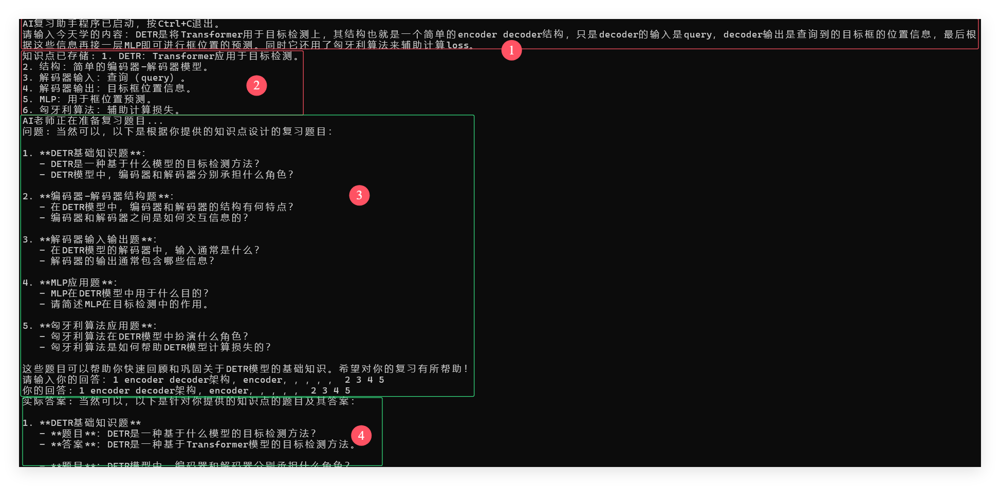

## 复习软件

### 1 摘要

基于遗忘曲线和大模型的问答能力，做一个软件，自动化整理学习内容和帮助复习

### 2 软件结构

软件主要是两个构能，存储阶段和复习阶段。

#### 一、存储阶段：

    1. 每天固定时间，打电话
        2. prompt问学的内容
        3. 将回复的话。让大模型整理为简短精炼的知识点，存储到数据库（sqlite）中

#### 二、复习阶段

    1. 也是固定时间打电话给用户
        2. prompt帮助复习某天（用遗忘曲线算出来，该问哪天）学的内容
           2.1 从那天的数据库中找到所学的知识
           2.2 根据知识出题让用户回答，以此达到复习的目的
            a. 例如直接把原句的重要部分挖掉，让用户回答重要部分是什么

### 3 使用方法

- 搞个kimi开放平台的API，填在kimi.py中
- 在AI_revierwer_beta_0.1.py中调整数据库名和学习复习时间。
- 直接跑 AI_reviewer_beta_0.1.py

### 4 测试

###  TODO

- [ ] 细化对话，可以让用户和AI多轮对话
- [ ] 移植到移动平台上，可以方便得多
